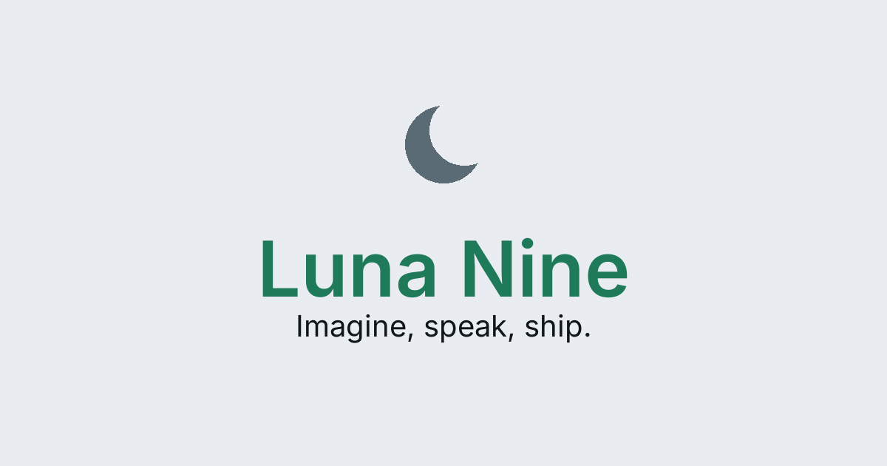
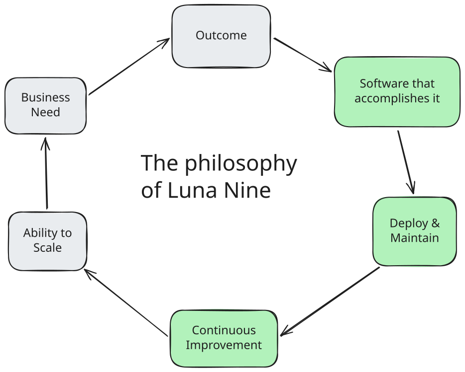
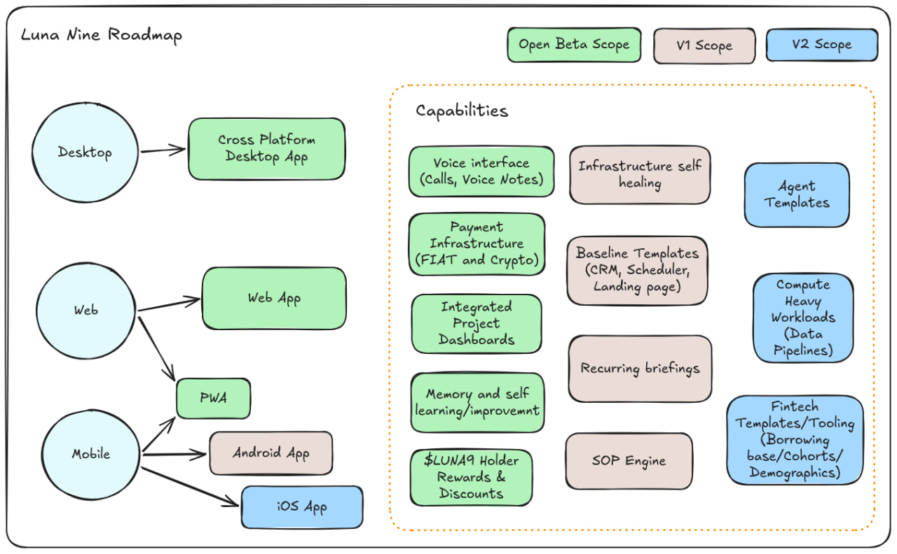

# Luna 9

Voice first, agent native.

**Imagine a developer that knows your business, is always awake, and takes care of deploying and maintenance.**

**_A mere five years ago this would have been an entire Managed Service Provider offer._**

### It's now an app on your phone, with a voice interface.

## What Luna 9 Does

Builds, deploys, and maintains the software tooling you need in your business, tailored specifically to your processes and workflows.

It lets you turn your intuition and processes into automations, handle payments, and enable you to scale revenue and free up time.

## Built For

Solo business owners or operators who need to scale revenue without scaling headcount.

These operators are looking into better tools and automations. But no one serves their niche or the software is geared for large teams. The large players have no incentive to cater to this market, but we do.

### By the numbers

27.2M US businesses are run by one person: 9.3M meaningful operators (≥$25k receipts) → 3.3M digital operators

**TAM ~$5.6B, SAM ~$2B (US, bottoms-up - Census NES, SBA)**

## Our Roadmap

### Timeline

-   Open Beta: launching October 1st.
-   v1 Release: November/December
-   v2 Release: Q1 2027

## Pricing Model

**An entry level plan: between $20 and $50 usd per month, yearly at 10x monthly.**

This plan would keep voice notes and text but not have phone calls. Exact pricing is yet to be determined and is actively being worked on.

**A premium plan: $100 per month, $1000 per year**

For additional usage we will have a top up model with "Booster Packs".

These add additional inference capacity, i.e. more usage. We predict these will only be required during heavy buildout phases, enabling businesses to keep the abse rate for when they need only their upkeep, hosting, and normal pace of building and improving tools.

## Luna 9 vs Competition

**Everyone sells the build. Nobody owns the loop.**

Builds

Deploys

Maintains

Solo-priced

Voice

Lovable · Bolt · Base44

✓

partial

✗

✓

✗

Cursor · Claude Code

✓ (you)

✗ (you)

✗ (you)

✓

✗

Devin

✓

partial

partial

✗

✗

Agencies

✓

✓

✗

✗

✗

Luna Nine

✓

✓

✓

✓

✓

No other coding agent even considers what you build as infrastructure. Luna Nine understands the outcome is not software per se, it's systems. Software is just the medium to express and use the systems.

## How we accomplish safety and effectiveness

We strive to provide stable and reliable tools, an agent that does what it needs to do, and to leverage the non deterministic nature of agents where it can shine, while maximizing what deterministic automation can do.

Judgment and choice where it is needed, robustness everywhere.

We follow these principles:

-   **Control:** customer approves plans and actions; built for user control
-   **Identity:** the agent works as a least-privilege bot, follows security principles
-   **Alignment:** requirements are always confirmed and clarified

## Why voice first

**Synchronous conversation often helps us think in ways we usually do not, similarly, letting a stream of consciouness come out in a voice message can lead us to realizations about our objective or desired outcome.**

Both of these mediums, the voice call and the voice message can happen on the go, in those tiny gaps in our busy days.

We could talk about the technology being ready and scalable but the truth is, voice matters more than we give it credit for.

By focusing on outcomes and asking questions where needed, Luna Nine helps the user find clarity and delivers results.

## How is the token integrated

We launched with the $LUNA9 token and have been blessed to have a community rally around us, supporting, and providing invaluable feedback.

The token and web3 will be deeply integrated into Luna Nine.

**Token holders get:**

-   Exclusive custom themes for desktop, web, and PWA.
-   Discounts on Booster Packs
-   Free usage for large holders of $LUNA9

_Exact threshold is to be determined._

**Planned after open beta**

-   $LUNA9 token based authentication for web3 native operators
-   Payments in $LUNA9

## Get Access

Waitlist is live at [luna9.space](https://luna9.space).

---

*Exported from [2050-to/luna9](https://github.com/2050-to/luna9) on 2026-09-10; live page: https://luna9.space/whitepaper*
